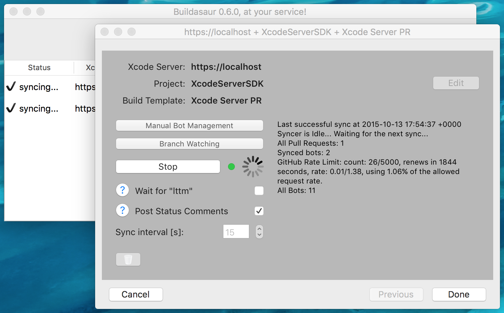
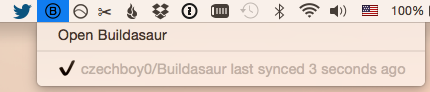

Buildasaur
==========

[](https://github.com/czechboy0/buildasaur/branches)
[](https://github.com/czechboy0/Buildasaur/releases/latest)
[](http://en.wikipedia.org/wiki/MIT_License)

[](http://honzadvorsky.com)
[](http://twitter.com/buildasaur)
[](http://twitter.com/czechboy0)


> Automatic testing of your Pull Requests on GitHub and BitBucket using Xcode Server. Keep your team productive and safe. Get up and running in minutes.

(Follow [Buildasaur on Twitter](http://twitter.com/buildasaur) for infrequent updates.)

:mortar_board: New to Xcode Server/Bots?
---------------------------------
To learn how to set up Xcode Server in minutes, check out my [Xcode Server Tutorials](http://honzadvorsky.com/pages/xcode_server_tutorials/).

:nut_and_bolt: Configurable
------------
Buildasaur was designed to be easy to setup, while still giving you all the customization you need. By choosing the right defaults, most teams can get Buildasaur set up *in minutes*, start it and never have to worry about it again.



:eyes: Glanceable
----------
Buildasaur runs as a background Mac app, its configuration window goes away when you don't need it. This gives you a chance to quickly peek at the status of your syncers from the menu bar.



:octocat: Supported Git Hosting Services
------------------
- GitHub
- BitBucket
- (are we missing yours? [Create an Issue](https://github.com/czechboy0/Buildasaur/issues) and I'll see if I can add it)

:arrow_down: Getting Buildasaur
------------------
- just download the `.app` of the [latest release](https://github.com/czechboy0/Buildasaur/releases/latest), which will offer to automatically update itself as new releases become available
- clone this repository, run `fastlane prebuild` and run it in Xcode (more work)

:hammer: Requirements
-----------
- Mac running at least OS X 10.11
- Xcode Server (see [my tutorials](http://honzadvorsky.com/pages/xcode_server_tutorials/) if you're new to Xcode Server)
- your projects hosted on GitHub or BitBucket

:blue_book: Xcode Versions
--------------
Xcode Server ships in Xcode, so the server API is also dependent on the Xcode you have. See the table of latest Buildasaur versions supporting each Xcode version.

| Xcode | last supported |
| :-- | :--: | :--: |
| Xcode 7 | :white_check_mark: [latest](https://github.com/czechboy0/Buildasaur/releases/latest) |
| Xcode 6 | :white_check_mark: [0.2.9](https://github.com/czechboy0/Buildasaur/releases/tag/v0.2.9) | 

:white_check_mark: Installation Steps
------------------
1. [Install Xcode Server](http://honzadvorsky.com/articles/2015-08-04-xcs_tutorials_1_getting_started/)
2. [Download](https://github.com/czechboy0/Buildasaur/releases/latest) Buildasaur
3. Setup Buildasaur
	- Checkout your project's repository locally over SSH
	- Launch Buildasaur
	- Click "New Syncer", which will guide you through setting one up
	- At the end of the flow, click "Start" to start syncing
	- You can add as many syncers (read: projects) as you want
	- You can close all Buildasaur's windows, it will keep running in the background (click on the [menu bar icon](#eyes-glanceable) to open the configuration window again)

# Features

## :arrows_clockwise: Default workflow
The default workflow is as follows:
- a Pull Request is opened by its author, Buildasaur creates a new Bot
- if the "lttm" barrier (see below) is disabled, an integration is started *immediately*. if the "lttm" barrier is enabled, Builda waits until someone comments "lttm" in the Pull Request conversation (the "lttm" barrier is **disabled** by default, can be disabled in the UI)
- an integration (building, testing and/or archiving) is performed on the PR's branch
- result of the integration is reported back to GitHub/BitBucket by changing the status of the latest commit of the branch and posting a comment in the PR conversation (optional, enabled by default)
- if any additional commits are pushed, another integration *automatically* gets performed and reported
- when the PR is merged or closed, the Bot gets deleted automatically
- if you require a different workflow, create an issue and we'll figure something out

## :unlock: The "lttm" barrier
- "Looks Testable To Me"
- an optional extra step in the workflow (**disabled** by default starting from version 0.5.0, was enabled by default in previous versions)
- instead of integrating immediately after a PR is created, the reviewer first has a chance to look at the code and request any fixes of the code from the author
- when the reviewer is happy with the code visually, she comments "lttm" in the PR and the bot is activated and performs an integration of the code
- from that point on, if any additional commits are pushed, they get integrated as with the basic workflow
- *useful for projects that take longer time to run tests*

## :envelope: Posting Status Comments
- Buildasaur by default posts a comment into the PR conversation when an integration finishes


- this can be changed in the UI with the toggle named "Post Status Comments"

## :pencil2: Manual Bot Management
In addition to automatic bot management with syncers, you can create bots from an existing Build Template and a branch by clicking *Manual Bot Management* when your syncer is setup. This is useful for creating one-off bots based on e.g. release branches with a different Build Template than you use for PRs.

## :eyeglasses: Branch Watching
All branches with open Pull Requests are automatically watched and tested. However, what if you wanted to watch a branch which does *not* have a Pull Request associated with it? Like `master`, or a release branch into which you're making final changes and want tested?

Buildasaur supports that. You can select extra watched branches that will automatically be tested and their statuses will be updated on GitHub. You can see the statuses of Buildasaur's branches [here](https://github.com/czechboy0/Buildasaur/branches), for instance.

Enabling watched branches is a prerequisite of getting [build badges](#vertical_traffic_light-build-badges) working with [satellite](https://github.com/czechboy0/satellite).

*Note that Branch Watching is only supported for GitHub-hosted projects.*

## :vertical_traffic_light: Build Badges
I built a tiny service called [satellite](https://github.com/czechboy0/satellite), which serves down badges based on GitHub status of a branch. And this status is automatically updated by Buildasaur when a build finishes (enable a *watched branch* in Buildasaur for whichever branch you'd like to base your badge on, usually `master`).

TL;DR?
Just add this to your README and replace `USER`, `REPO` and `BRANCH` with your info. And you'll get a build badge like this: 

```
[](https://github.com/USER/REPO/branches)
```
If you don't specify a branch, *master* will be used.

:heartpulse: Heartbeat
---------------
In order to understand how many Buildasaur instances are actively being used (which helps me to decide how much free time I should dedicate to this project), **one** anonymous heartbeat event is sent from Buildasaur every 24 hours (and one when Buildasaur is launched). There is **absolutely no information** about your projects being synced with Buildasaur (I don't care about that, that's *your* business), the event just sends a randomly generated identifier (to discern between different Buildasaur instances), the uptime of Buildasaur (to potentially detect crashes) and the number and type of running syncers.

I wrote the server storing this data myself - and [it's open source](https://github.com/czechboy0/ekg), so feel free to take a peek yourself at how that's done. And take a look [here](https://github.com/czechboy0/ekgclient/blob/master/ekgclient/Event.swift#L39) to see exactly what data is being sent.

Despite absolutely no identifiable data being sent, if you still aren't comfortable allowing Buildasaur to send its heartbeat, add `"heartbeat_opt_out" = true` to `~/Library/Application Support/Buildasaur/Config.json`. But please keep in mind that if you do that, it will make me think fewer people are in fact using Buildasaur, which might just lead to me spending less time on improving it.

:warning: Troubleshooting
---------------
If Builda crashes, you can find crash logs at `~/Library/Logs/DiagnosticReports/Buildasaur-*`. Please let me know if that happens and I'll take a look. Also, Builda logs (pretty verbosely) to `~/Library/Application Support/Buildasaur/Logs`, so this is another place to watch in case of any problems. You can find all persisted files that Buildasaur keeps around at `~/Library/Application Support/Buildasaur/`, which is also what you might want to back up or migrate if you're moving your setup between machines.

Version 0.8.0 adds Crashlytics, so I receive crash reports. If you prefer to opt-out of crash reporting, you can do so by adding `"crash_reporting_opt_out" = true` to `~/Library/Application Support/Buildasaur/Config.json`.

:arrow_right_hook: Looking for Xcode Server SDK?
----------------
The code for communication with Xcode Server lives in a project called [XcodeServerSDK](https://github.com/czechboy0/XcodeServerSDK).

:gift_heart: Contributing
------------
Please create an issue with a description of your problem or a pull request with a fix. Or, if you just want to help out, take a look at [issues with the label "up-for-grabs"](https://github.com/czechboy0/Buildasaur/labels/up-for-grabs), comment on the issue that you're working on it and let's improve Buildasaur together! 

:v: License
-------
MIT

:+1: Special Thanks
---
- Vojta Micka ([@higgcz](https://twitter.com/higgcz)) for our great new logo!

:alien: Author
------
Honza Dvorsky - http://honzadvorsky.com, [@czechboy0](http://twitter.com/czechboy0)
